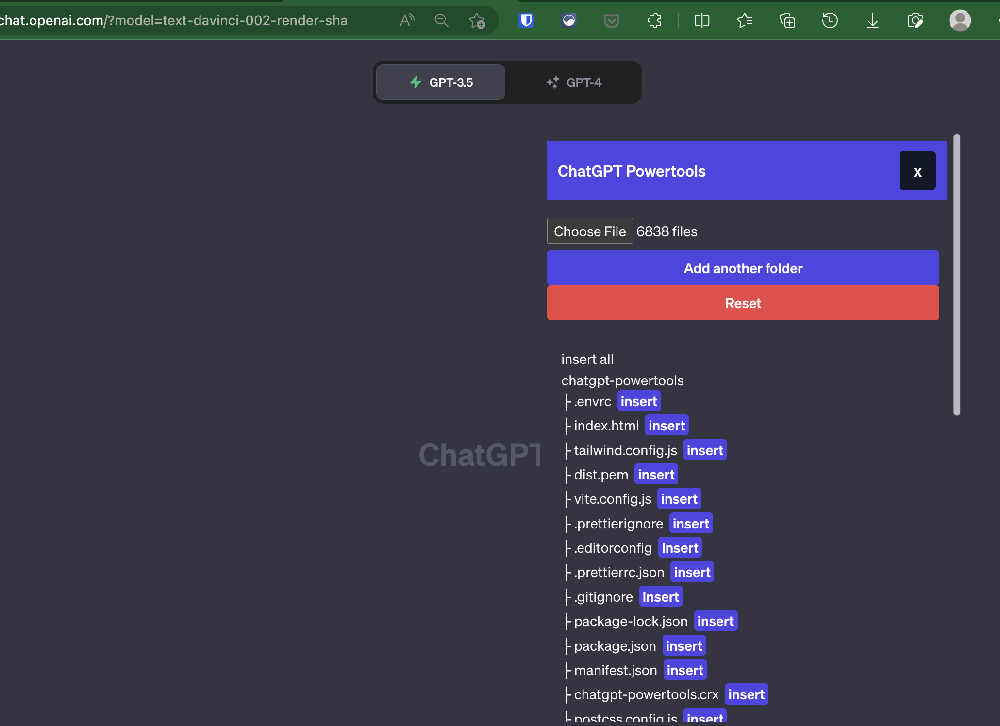

# ChatGPT Powertools

A Chrome extension that adds extra functionality to ChatGPT.

## Features

- [x] Upload files and folders
- [ ] Autocomplete prompts
- [ ] Suggest prompts
- [ ] Download conversation
- [ ] Download a response
- [ ] Upload images as base64

## Installation

1. Download [dist.zip](https://github.com/nadimtuhin/chatgpt-powertools/blob/main/dist.zip) from the latest release and unzip it.
2. Go to `chrome://extensions`
3. Enable developer mode
4. Click "Load unpacked" and select the unzipped folder

For detailed steps: https://dev.to/ben/how-to-install-chrome-extensions-manually-from-github-1612

## Development Setup

1. Go to `chrome://extensions`
2. Enable developer mode
3. Click "Load unpacked" and select the `dist` folder
4. Open the ChatGPT website

```bash
yarn install
yarn dev
```

## Screenshots


